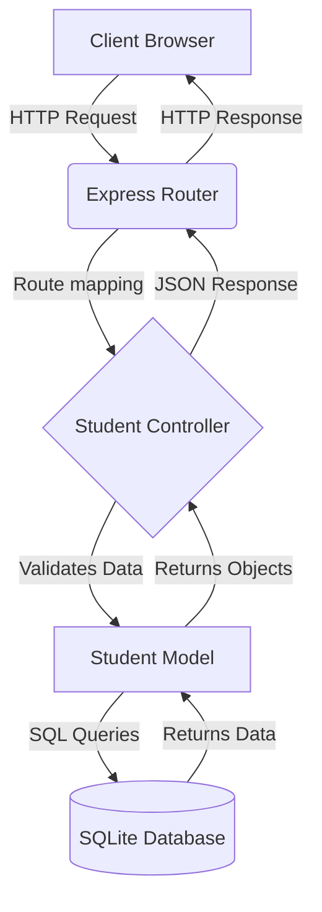

# 🎓 Enterprise Student Management System


A fully functional, enterprise-grade **Student Management System** built with a Node.js/Express backend, an SQLite database, and a beautiful, modern Vanilla JavaScript frontend. The project features a stunning glassmorphism UI, interactive elements, a chatbot, and a robust CRUD dashboard.

---

## ✨ Key Features

- **Full CRUD Operations**: Seamlessly Create, Read, Update, and Delete student records.
- **Advanced Data Table**: Real-time search by name, email, or major, along with dynamic column sorting.
- **Premium User Interface**: Dark-mode aesthetic with glassmorphism, gradient accents, and CSS animations.
- **AI Chatbot Interface**: An interactive widget designed to assist users with system navigation.
- **Relational Integrity**: Built on an SQLite relational database ensuring structured, secure data storage.
- **Zero Configuration**: Uses a local SQLite file (`database.sqlite`) meaning no heavy database server installation is required.

---

## 🏗️ Architecture

The application follows a strict **Model-View-Controller (MVC)** architectural pattern to ensure a clean separation of concerns and highly maintainable code.

### System Flowchart



### Directory Structure

```text
📦 student-management-system
├── 📂 config/
│   └── 📄 db.js                 # SQLite database connection setup
├── 📂 controllers/
│   └── 📄 studentController.js  # Business logic and input validation
├── 📂 models/
│   └── 📄 studentModel.js       # Database SQL queries
├── 📂 routes/
│   └── 📄 studentRoutes.js      # API route definitions
├── 📂 public/                   # Frontend Assets (Views)
│   ├── 📄 index.html            # Landing page with chatbot
│   ├── 📄 dashboard.html        # Main CRUD application UI
│   ├── 📂 css/
│   │   └── 📄 style.css         # Premium UI styles
│   ├── 📂 js/
│   │   ├── 📄 main.js           # UI animations
│   │   ├── 📄 chatbot.js        # Chatbot interaction logic
│   │   └── 📄 dashboard.js      # Frontend API integration
│   └── 📂 assets/               # Images and icons
├── 📄 init_db.js                # Script to create DB schema
├── 📄 seed_db.js                # Script to populate mock data
└── 📄 server.js                 # Express Application entry point
```

---

## 🚀 Getting Started

Follow these steps to run the application on your local machine.

### Prerequisites
- [Node.js](https://nodejs.org/) (v14 or higher) installed.

### Installation

1. **Clone the repository:**
   ```bash
   git clone https://github.com/poojaspy9730/student-management-system.git
   cd student-management-system
   ```

2. **Install dependencies:**
   ```bash
   npm install
   ```

3. **Initialize the Database:**
   *This command creates the `database.sqlite` file and the `students` table.*
   ```bash
   node init_db.js
   ```

4. *(Optional)* **Seed the Database:**
   *Run this to populate the database with sample student data.*
   ```bash
   node seed_db.js
   ```

5. **Start the Application:**
   ```bash
   node server.js
   ```

6. **View the App:**
   Open your browser and navigate to `http://localhost:3000`.

---

## 🛠️ Built With

* **Backend**: Node.js, Express.js
* **Database**: SQLite (via `sqlite` and `sqlite3` packages)
* **Frontend**: HTML5, Vanilla CSS3, Vanilla JavaScript (ES6+)
* **Icons**: FontAwesome

---

*Designed and developed as an enterprise-grade CRUD application demonstration.*
